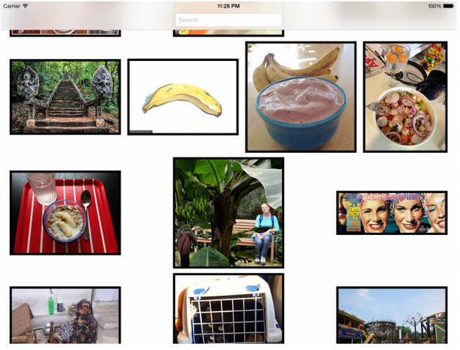
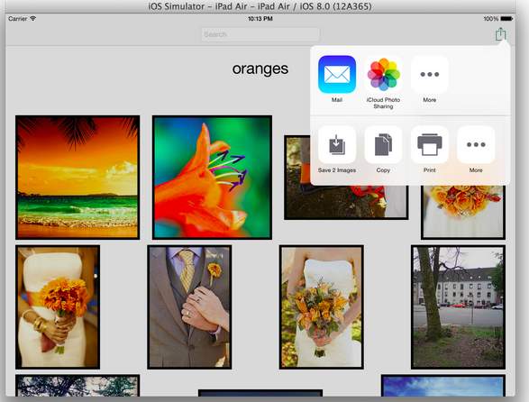
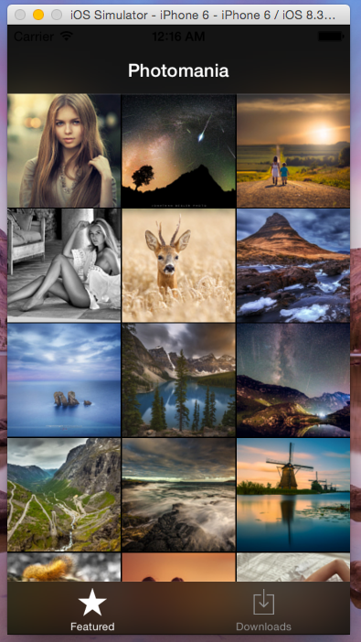
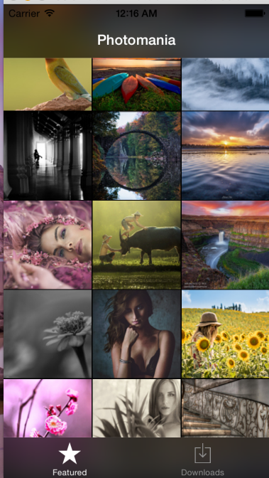
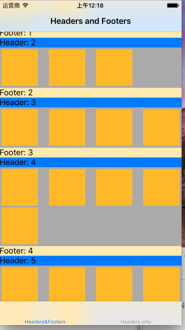
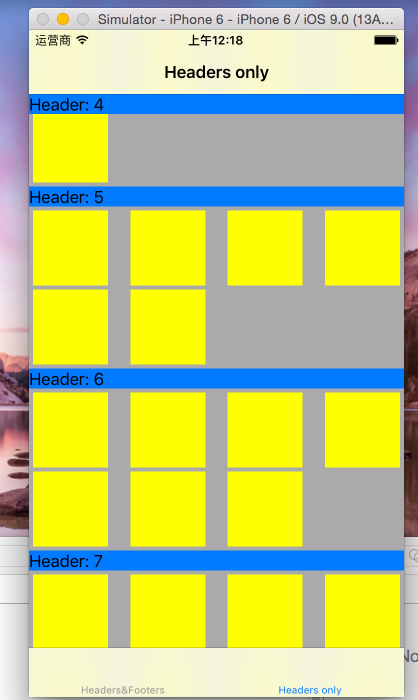
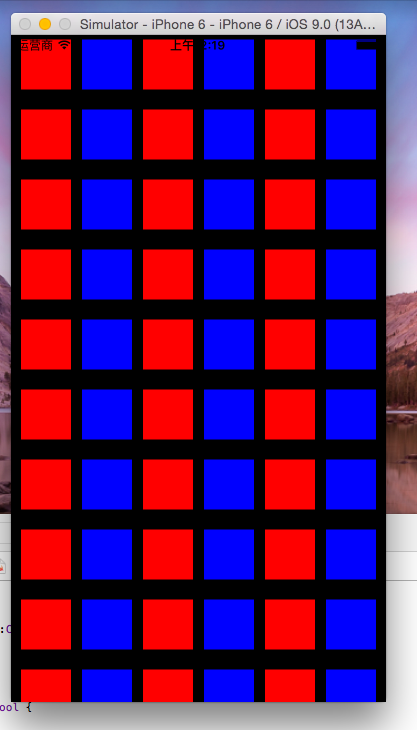

# The Summary of the UICOllectionView 
**参考网络教程，自己总结而来**
***

* [UICollectionViewCustomLayout](/Pinterest)
	 1. Core Layout Process(核心布局的处理过程)
		继承UICollectionViewLayout必须实现如下方法：
			- prepareLayout():
				 布局将要生效在方法里面计算好item的position，collection的size
			- collectionViewContentSize()
				 返回CollectionViewContentSize 不是size(width,height)，contentSize一般比size要大 
			- layoutAttributeForElementsInRect()
				 返回特定区域内的布局属性
	 2. Calculating Layout Attributes(计算 布局的属性)
	 			 
* UICollectionViewFlowLayout

## eg 1. FlickrSearch 

## eg 2. Photomania  

## eg 3. UICollectionFlowLayout

## eg 4. UICollectionViewDelegateFlowLayout 

